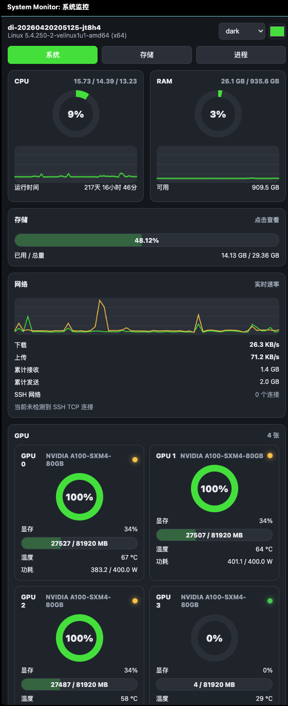
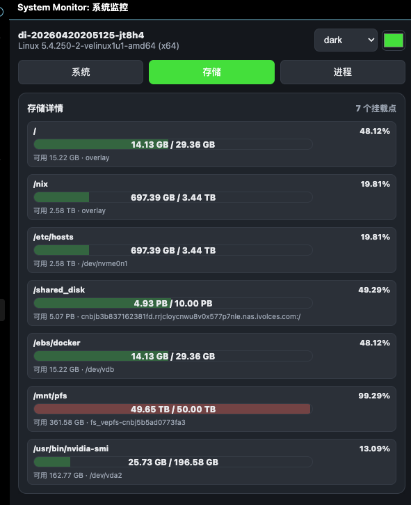
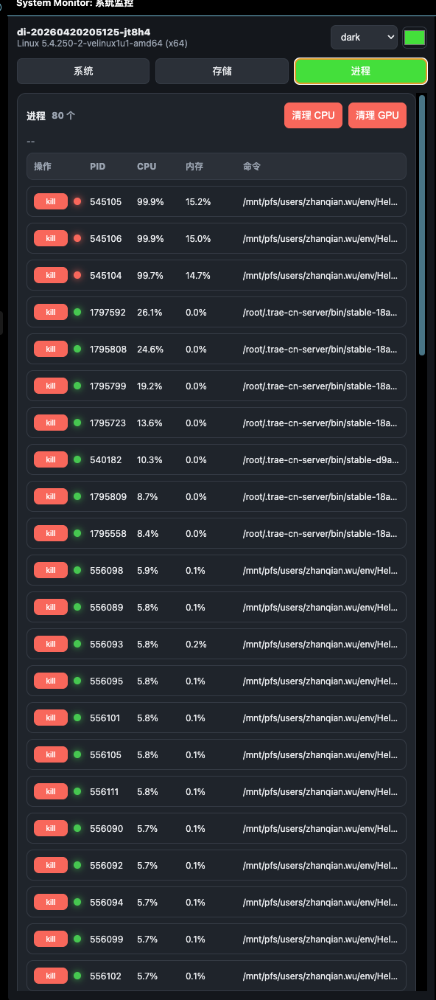

# System Monitor VS Code Extension

A side-panel system monitor for VS Code, designed for Linux machines, training servers, and debugging workstations.
Monitor CPU, memory, storage, network, GPU, processes, and SSH connections directly inside the IDE, with quick actions such as kill and clean-up.


## Preview

### System Page
CPU / RAM gauges with live trend lines, a storage strip, and a network module that shows the live rate chart on top and details / SSH connections below.

### Storage Page
Click the storage strip on the System page to open the dedicated Storage page, showing every mount point: used / total, available, filesystem, and usage bar.

### Process Page
Processes are sorted by CPU usage. Each row shows a status LED, a kill button, CPU%, memory%, PID, and the command line. The top-right corner provides `Clean CPU` and `Clean GPU` shortcuts.

## Features

### System Monitoring
- CPU
  - Current usage
  - Load average
  - Uptime
  - Live trend chart (color follows the accent color)
- RAM
  - Used / total
  - Free
  - Live trend chart (color follows the accent color)
- Storage
  - A horizontal strip on the System page shows the total usage (2 decimal places)
  - A dedicated Storage page lists every mount point
- Network
  - Live download / upload rates
  - Total received / sent
  - Live rate chart
  - SSH TCP connection list
- GPU
  - Utilization
  - Memory usage (translucent bar that changes color with usage)
  - Temperature
  - Power draw
  - Status LED: idle / busy / hot or overloaded

### Process Management
- Process list
  - Status LED (normal / active / high)
  - Kill button (with confirmation)
  - CPU%, memory%, PID, command
- Clean CPU: kills non-system processes whose CPU usage is >= 80%.
- Clean GPU: kills processes that are currently using the GPU.
- Kill / clean use SIGKILL first, and fall back to `kill -9` if needed.

### Themes and Appearance
- Themes: dark / light / midnight / forest / purple
- Color picker: customize the accent color and the network download line
- Status feedback
- Buttons are disabled immediately after click and show `killing` or `request sent` to avoid the no-response look
- After reinstalling, reload the VS Code window

### Multi-Language Support
- Languages: Chinese (zh), English (en), Japanese (ja), Russian (ru)
- A language switcher is available in the top-right corner of the System page
- All labels, buttons, and status messages are translated

## Screenshots

| System | Storage | Process |
| --- | --- | --- |
|  |  |  |

> These are placeholders. Capture real screenshots in VS Code and drop them into `resources/` with the names above.

## Project Layout

```text
system_monitor/
├── dist/                  # Bundled entry shipped inside the .vsix
│   └── extension.js
├── src/                   # TypeScript source
│   └── extension.ts
├── resources/             # Icons and static assets
│   └── monitor.svg
├── package.json           # VS Code extension manifest
├── package_vsix.py        # Python-based packager (no npm required)
├── tsconfig.json          # TypeScript config
└── README.md
```

## Installation

### Option 1: Install the existing vsix

```bash
code --install-extension /mnt/pfs/users/zhanqian.wu/tools/system_monitor/system-monitor-0.0.18.vsix --force
```

### Option 2: Build your own vsix

No Node.js / npm required. Use the Python script to package:

```bash
cd /mnt/pfs/users/zhanqian.wu/tools/system_monitor
python3 package_vsix.py
```

The output file:

```text
system-monitor-<version>.vsix
```

Then install it with `code --install-extension`.

## Usage

1. After installation, a "System Monitor" icon appears in the VS Code activity bar.
2. Click the icon to open the side panel.
3. The default page is `System`. Click the storage strip to enter the `Storage` page.
4. On the `Process` page, click a row's `kill` button to end a process, or use the top-right `Clean CPU` / `Clean GPU` buttons to batch kill.
5. The theme and color picker live in the top-right corner.
6. Use the language switcher (top-right on the System page) to switch between Chinese, English, Japanese, and Russian.

## Settings

| Setting | Description |
| --- | --- |
| `systemMonitor.refreshInterval` | Refresh interval in milliseconds, default `2000` |

Open Settings UI:

```text
Ctrl + , -> search "systemMonitor"
```

## Development

- `dist/extension.js` is the file that is actually packaged into the `.vsix`.
- If you change `src/extension.ts`, compile it to `dist/` first, or edit `dist/extension.js` directly.
- The build does not depend on npm, avoiding environment drift.

### Publishing

1. Bump the `version` in `package.json`.
2. Run `python3 package_vsix.py`.
3. Distribute the generated `.vsix`.

## Dependencies

- VS Code >= 1.85
- `nvidia-smi` (optional, for GPU monitoring; a placeholder is shown if missing)
- `ps` (Linux process list)
- `df` (disk info)
- `/proc/net/dev` and `/proc/net/tcp{,6}` (network and SSH)

## FAQ

### Clean GPU fails
- `nvidia-smi` may return invalid PIDs. The extension processes PIDs one by one and reports the success / failure counts.
- Killing processes owned by other users requires running VS Code as root.

### Status LED colors
- The LED uses `var(--ok)` / `var(--warn)` / `var(--danger)`, which follow the active theme. Themes such as `purple` and `forest` will tint the LED colors accordingly.

### Text overflow
- 0.0.17 fixed text overflow for the network and SSH sections on narrow widths.

### Language switching
- Click the language selector in the top-right corner of the System page.
- The selected language is persisted across sessions.

## Changelog

| Version | Changes |
| --- | --- |
| 0.0.18 | Multi-language support: Chinese, English, Japanese, Russian |
| 0.0.17 | Fix text overflow for network and SSH on narrow widths |
| 0.0.16 | Network module layout: chart on top, info below |
| 0.0.15 | System page storage turned into a strip; network spans two columns |
| 0.0.14 | Storage details moved to a dedicated page; SSH network truncates long values |
| 0.0.13 | Removed the refresh button; storage sub bar shortened |
| 0.0.12 | Strict GPU PID parsing; per-PID kill |
| 0.0.11 | Kill / clean confirmations moved to native VS Code dialogs + status messages |
| 0.0.10 | Kill uses SIGKILL; button gives instant feedback |
| 0.0.9 | Process status LEDs, clean buttons on the right, compact storage sub list |
| 0.0.8 | More themes; GPU status LEDs; process kill and clean GPU |
| 0.0.7 | Process page + kill button + clean GPU |
| 0.0.6 | CPU / RAM trend charts (cards keep their size) |
| 0.0.5 | Storage display with 2 decimal places |
| 0.0.4 | Unified 2x2 layout on the System page |
| 0.0.3 | Light / dark theme, color picker, translucent GPU bar, network chart, SSH network |
| 0.0.2 | Fix Webview not refreshing on first load |
| 0.0.1 | Initial release |
